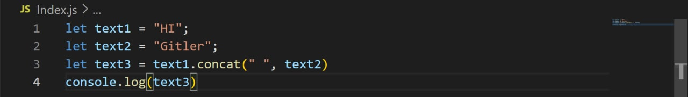

# String Methods
### What is method in Java Script ?

#### Note: In JavaScript functions themselves are objects, so, in that context, a method is actually an object reference to a function.

# Create JavaScript Strings
#### In JavaScript, strings are created by surrounding them with quotes.  There are three ways you can use quotes.
#### • Single quotes: 'Hello'
#### • Double quotes: "Hello"
#### • Backticks: `Hello`

#### Single quotes and double quotes are practically the same and you can use either of them.
#### Backticks are generally used when you need to include variables or expressions into a string. This is done by wrapping variables or expressions with ${variable or expression} as shown above

## String Methods

### JavaScript String Length
#### The length property returns the length of a string:

# Extracting String Parts
### There are 3 methods for extracting a part of a string:
#### slice(start, end)
#### substring(start, end)
#### substr(start, length)

# JavaScript String slice()
### slice() extracts a part of a string and returns the extracted part in a new string.
### The method takes 2 parameters: start position, and end position (end not included).
#### Example
##### Slice out a portion of a string from position 7 to position 13:

# Note
### `JavaScript counts positions from zero.`
### ` First position is 0.`
### `Second position is 1`

#### Examples
##### If you omit the second parameter, the method will slice out the rest of the string:

##### If a parameter is negative, the position is counted from the end of the string:

##### This example slices out a portion of a string from position -12 to position -6:

# JavaScript String substring()
## substring() is similar to slice().
### The difference is that start and end values less than 0 are treated as 0 in substring().
#### Example

### If you omit the second parameter, substring() will slice out the rest of the string

# JavaScript String substr()
## substr() is similar to slice().
## The difference is that the second parameter specifies the length of the extracted part.
#### Example

##### If the first parameter is negative, the position counts from the end of the string.

# Replacing String Content
### The replace() method replaces a specified value with another value in a string:

# Note
### The replace() method does not change the string it is called on.
### The replace() method returns a new string.
### The replace() method replaces only the first match
###  If you want to replace all matches, use a regular expression with the /g flag set. See examples below.
#### By default, the replace() method replaces only the first match:

## By default, the replace() method is case sensitive. Writing FARIDUN (with upper-case) will not work:

### To replace case insensitive, use a regular expression with an /i flag (insensitive):

# Note
### Regular expressions are written without quotes.
#### To replace all matches, use a regular expression with a /g flag (global match):

# JavaScript String ReplaceAll()
### In 2021, JavaScript introduced the string method replaceAll():

#### The replaceAll() method allows you to specify a regular expression instead of a string to be replaced. If the parameter is a regular expression, the global flag (g) must be set set, otherwise a TypeError is thrown.

# Converting to Upper and Lower Case
## A string is converted to upper case with toUpperCase():
## A string is converted to lower case with toLowerCase():

#JavaScript String toUpperCase()

#JavaScript String toLowerCase()

# JavaScript String concat()
## concat() joins two or more strings:

# Note
## All string methods return a new string. They don't modify the original string.

#JavaScript String trim()
## The trim() method removes whitespace from both sides of a string:

# JavaScript String trimStart()
## ECMAScript 2019 added the String method trimStart() to JavaScript.
## The trimStart() method works like trim(), but removes whitespace only from the start of a string.

#### Example

# JavaScript String trimEnd()
## ECMAScript 2019 added the String method trimEnd() to JavaScript.
## The trimEnd() method works like trim(), but removes whitespace only from the end of a string.

# JavaScript String Padding
## ECMAScript 2017 added two String methods: padStart() and padEnd() to support padding at the beginning and at the end of a string.
### JavaScript String padStart()
### The padStart() method pads a string with another string:

# JavaScript String padEnd()
## The padEnd() method pads a string with another string:

# JavaScript String charAt()
## The charAt() method returns the character at a specified index (position) in a string:

# JavaScript String charCodeAt()
## The charCodeAt() method returns the unicode of the character at a specified index in a string: The method returns a UTF-16 code (an integer between 0 and 65535).

# JavaScript String split()
## A string can be converted to an array with the split() method:

